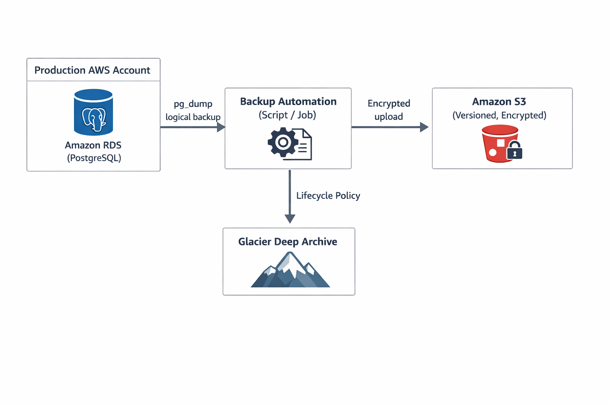

# AWS PostgreSQL Backup & Archival Architecture

## 1. Project Overview

This project demonstrates a production‑grade backup and archival strategy for PostgreSQL databases hosted on AWS RDS.

The primary goal of this project is to design a **reliable, cost‑effective, and recoverable backup system** for historical and active PostgreSQL data, ensuring business continuity and compliance.

This solution focuses on:
- Long‑term data retention (2023–2025 and beyond)
- Disaster recovery preparedness
- Automation and operational ownership
- Clear documentation and architecture visibility

This project is designed from a **Lead / Cloud Architect perspective**, prioritizing design decisions and recovery strategies over simple scripting.

---

## 2. Architecture Diagram

### High‑Level Architecture Explanation

- PostgreSQL runs on **Amazon RDS**
- Logical backups are taken using `pg_dump`
- Backups are stored securely in **Amazon S3**
- Older backups are archived to **S3 Glacier** using lifecycle policies
- Automation is handled using **GitHub Actions**
- Monitoring and recovery procedures are clearly documented

---

## 3. AWS Setup Steps (Console‑Based)

### 3.1 Create an S3 Bucket for Backups

1. Go to **AWS Console → S3**
2. Click **Create bucket**
3. Bucket name: `pg-backup-archival-bucket`
4. Region: Same as RDS
5. Enable:
   - Versioning
   - Default encryption (SSE‑S3 or SSE‑KMS)
6. Block public access
7. Create bucket

---

### 3.2 Configure Lifecycle Policies (Cost Optimization)

1. Open the S3 bucket
2. Go to **Management → Lifecycle rules**
3. Create rule:
   - Move objects to **Glacier after 30 days**
   - Delete after **2 years (optional, based on compliance)**

This reduces storage costs while keeping data retrievable.

---

### 3.3 RDS Configuration

1. Ensure RDS PostgreSQL instance has:
   - Automated backups enabled
   - Backup retention ≥ 7 days
2. Enable snapshots for major releases
3. Ensure RDS is in a **private subnet**

---

### 3.4 IAM & Security

- Use IAM roles instead of access keys
- Grant least‑privilege access:
  - S3 write permissions
  - CloudWatch logging
- Secrets are never stored in GitHub

---

## 4. Backup Strategy

This project uses **multiple layers of backups** to handle different failure scenarios.

### 4.1 Backup Types Used

| Backup Type | Purpose |
|------------|--------|
| RDS Automated Backups | Point‑in‑time recovery |
| Manual Snapshots | Pre‑deployment safety |
| Logical Backups (`pg_dump`) | Granular restores |
| S3 Archival | Long‑term retention |

---

### 4.2 Logical Backup Flow

1. GitHub Actions triggers backup job
2. `pg_dump` exports the database
3. Backup file is uploaded to S3
4. Lifecycle policies archive data to Glacier

This allows restoring **specific tables or schemas**, which snapshots cannot do.

---

## 5. Automation Using GitHub Actions

GitHub Actions is used to simulate scheduled backups.

### Why GitHub Actions?

- No additional AWS cost
- CI/CD‑native
- Easy scheduling using cron
- Demonstrates automation mindset

### Automation Capabilities

- Scheduled backups (cron)
- Manual trigger for testing
- Safe simulation without real secrets

---

## 6. Disaster Recovery Strategy

### 6.1 Recovery Objectives

| Metric | Target |
|------|-------|
| RPO | 24 hours |
| RTO | 4 hours |

---

### 6.2 Recovery Scenarios

#### Scenario 1: Accidental Data Deletion
- Restore using `pg_dump` backup from S3

#### Scenario 2: RDS Failure
- Restore from RDS snapshot
- Attach to new RDS instance

#### Scenario 3: Region Failure
- Use cross‑region S3 replication (future scope)

---

## 7. Operations & Monitoring

### 7.1 Backup Validation

- Monthly restore testing
- Validate database integrity
- Document restore success/failure

---

### 7.2 Monitoring

- S3 storage metrics
- Backup job execution logs
- Alerting via CloudWatch (future scope)

---

## 8. Security Considerations

- No credentials stored in code
- Encryption at rest and in transit
- IAM least privilege
- Private networking for RDS

---

## 9. Design Decisions & Trade‑Offs

| Decision | Reason |
|--------|-------|
| Logical backups | Granular recovery |
| S3 + Glacier | Cost optimization |
| GitHub Actions | Lightweight automation |
| Documentation‑first | Operational clarity |

---

## 10. Scope & Assumptions

### In Scope
- Backup architecture
- Recovery strategy
- Cost‑aware storage
- Automation design

### Out of Scope
- Real production credentials
- Full restore execution
- Multi‑region DR (future enhancement)

---

## 11. Future Enhancements

- AWS Backup integration
- Cross‑region replication
- Lambda‑based automation
- Alerting via SNS

---

## 12. GitHub Repository

🔗 https://github.com/DevOpsJen/aws-postgresql-backup-archival

---

## 13. Final Notes

This project demonstrates **how a Lead or Architect thinks** about backups:
- Not just how to take them
- But how to restore them
- How much they cost
- And how they are operated in real life
